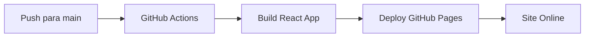

# 🚀 Deploy Automático - GitHub Pages

Deploy automático configurado para o AICodeGen usando GitHub Actions.

## 🎯 Como Funciona

1. **Push para `main`** → Deploy automático iniciado
2. **GitHub Actions** → Build da aplicação React
3. **GitHub Pages** → Site publicado automaticamente
4. **URL**: `https://PauloHenriqueJr.github.io/aicodegen`

## ⚙️ Configuração GitHub Pages

No seu repositório GitHub:
1. **Settings** > **Pages**
2. **Source**: GitHub Actions
3. Salvar

## 🔄 Fluxo Automatizado



## 📝 Arquivos de Configuração

- **`.github/workflows/deploy.yml`** - Workflow de deploy automático
- **`apps/web/public/404.html`** - Fix para routing em SPAs no GitHub Pages
- **`apps/web/index.html`** - Script de redirecionamento para navegação client-side

## 🏗️ Build Local

```bash
# Desenvolvimento
cd apps/web && npm run dev

# Build de produção
cd apps/web && npm run build
```

## ⚠️ Navegação em SPAs

O GitHub Pages não suporta nativamente SPAs. Solução implementada:

1. **404.html** - Redireciona rotas não encontradas para a página principal
2. **Script no index.html** - Restaura a URL correta após redirecionamento
3. **Base path** no Vite configurado para `/aicodegen/`

## 🌐 URLs

- **Repositório**: https://github.com/PauloHenriqueJr/aicodegen
- **Site**: https://PauloHenriqueJr.github.io/aicodegen
- **Actions**: https://github.com/PauloHenriqueJr/aicodegen/actions
